# Refill Cycle Filtering & 1-Click Ready Order Reminder Implementation Plan

> **Tracking Doc**: [implementation.md](file:///e:/CURRENT%20PROJECT%20ON%20WORKING/AI%20PHARMACY%20v2/implementation.md)  
> **Status**: Ready to Execute  
> **Created**: 2026-10-02  

---

## 1. Requirements & Objective Summary

1. **Refill Cycle Filtering**:
   - When sending a quick reminder / collection reminder for a patient with multiple regular medicines, the system must **strictly filter by the medicine's interval/due date** (e.g., 15-day, 30-day, or 180-day cycle).
   - If one medicine is on a 15-day cycle (due now) and another is on a 180-day cycle (due in 5 months), the reminder message must **only include the 15-day medicine**.
   - The message copy must be a clean, polite collection reminder: informing the patient that their regular prescription medicines are packed and awaiting pickup at the pharmacy.

2. **Special Order 1-Click "Mark Ready" Auto-Send**:
   - When staff clicks **Mark Ready** on a special order (in CRM Special Requests or Quick Assist), the system must immediately mark the order as `Ready` and auto-enqueue the customer WhatsApp arrival notice in **1 click**.
   - No unnecessary multi-step confirmation modals required for standard arrival.

3. **Human-in-the-Loop Safeguards (Rule 6)**:
   - Provide an **8-second interactive Undo toast** upon marking Ready. If clicked in error, clicking **Undo** reverts the order status and cancels the queued WhatsApp notification before dispatch.
   - Retain a Shift+Click or option to open the `SpecialOrderArrivalModal` if the pharmacist wants to add custom delay notes or preview.

---

## 2. Technical Architecture & Data Flow

```mermaid
flowchart TD
    subgraph Refills ["1. Refill Reminder Pipeline"]
        R1[Pharmacist clicks Send Refill] --> R2[Backend /send-grouped or /send-reminder-now]
        R2 --> R3["Filter query: next_refill_date <= date('now', '+7 days')"]
        R3 --> R4["Select ONLY due meds (e.g. 15d meds now; 180d excluded)"]
        R4 --> R5["buildRefillReminderMessage (Polite Collection Template)"]
        R5 --> R6[Enqueue to WhatsApp Queue]
    end

    subgraph SpecialOrders ["2. Special Order 1-Click Ready Pipeline"]
        S1[Pharmacist clicks 'Mark Ready'] --> S2["POST /api/orders/:id/status { status: 'Ready' }"]
        S2 --> S3["Backend enqueues WhatsApp Arrival notice"]
        S3 --> S4["Frontend displays 8s Interactive Undo Toast"]
        S4 -->|Staff clicks Undo| S5["POST /api/orders/:id/undo-ready (Reverts status + cancels queue item)"]
        S4 -->|Timeout expires| S6[WhatsApp dispatched safely]
    end
```



---

## 3. Atomic Tasks Checklist

### Task 1: Backend Refill Due Date & Cycle Filtering (`src/routes/refills.ts`)
- [ ] In `POST /api/refills/send-reminder-now`, add query gate:
  ```sql
  WHERE pr.patient_phone = ? 
    AND pr.is_active = 1
    AND (pr.next_refill_date IS NULL OR DATE(pr.next_refill_date) <= DATE('now', '+7 days', 'localtime'))
  ```
- [ ] In `POST /api/refills/send-grouped`, ensure that when `refill_ids` are omitted, the fallback query applies the same `DATE(pr.next_refill_date) <= DATE('now', '+7 days', 'localtime')` gate so 180-day future medicines are never bundled.
- [ ] Update `buildRefillReminderMessage`:
  - English: *"Dear {CustomerName}, your regular prescription medicines are packed and ready for collection at our pharmacy: ... Please collect at your earliest convenience."*
  - Hindi & Marathi: Match the same respectful, polite pickup wording.
- [ ] **Verification**: Unit test / test script triggering refill reminder for patient with mixed intervals (15d due today, 180d due in 5 months) verifies that only the 15d medicine is queued.

### Task 2: Frontend Quick Assist & CRM Refill Display Alignment (`Layout.tsx` & `CRM/index.tsx`)
- [ ] In `frontend/src/components/Layout.tsx` (`groupedActionableRefills`):
  - Verify `group.medicines` only includes items where `diffDays <= 7`.
  - When `handleSendRefillGroup` is invoked, pass only the filtered due medicine IDs in `refill_ids`.
- [ ] Display the interval badge (e.g. `15d`, `30d`, `180d`) clearly alongside medicine names in both expanded and compact views.
- [ ] **Verification**: Visually confirm in Quick Assist and CRM Refills tab that 180-day future items are not shown as due, and sending reminder only queues the due medicines.

### Task 3: Special Orders 1-Click "Mark Ready" Auto-Send (`CRM/index.tsx` & `Layout.tsx`)
- [ ] In `frontend/src/pages/CRM/index.tsx`:
  - Update the `📱 Ready` button onClick to directly call `handleUpdateStatus(order.id, 'Ready')` instead of forcing `handleNotifyArrival`.
  - Add Shift+Click support on the button to open `SpecialOrderArrivalModal` if the pharmacist specifically wants custom message editing.
- [ ] In `frontend/src/components/Layout.tsx` (Quick Assist):
  - Streamline `handleUpdateGroupStatus` so that marking Ready for special orders auto-queues immediately without mandatory arrival modal interruption.
- [ ] **Verification**: Click `📱 Ready` in CRM and verify order immediately switches to `Ready` and arrival notice is queued in WhatsApp queue.

### Task 4: Human-in-the-Loop Interactive Undo Action (`frontend` + `src/routes/orders.ts`)
- [ ] In `src/routes/orders.ts`, implement `POST /api/orders/:id/undo-ready`:
  - Reverts order status back to `Pending` (or previous status).
  - Finds any pending WhatsApp queue items for this order in `whatsapp_send_queue` and cancels them (`status = 'cancelled'`).
  - Broadcasts `orders_changed` SSE event.
- [ ] In `CRM/index.tsx` and `Layout.tsx`:
  - When marking Ready, trigger an 8-second toast:  
    `toastEvent.triggerAction('Order marked Ready & WhatsApp queued', 'Undo', () => api.undoReadyOrder(order.id))`
- [ ] **Verification**: Click "Mark Ready", immediately click "Undo" within the toast, verify order reverts to Pending and WhatsApp queue item is cancelled.

### Task 5: Quality Guardrails & Documentation
- [ ] Run `npm run guardrails` (ensure 0 errors).
- [ ] Run `node scripts/quick-update.mjs` to refresh the knowledge graph.
- [ ] Verify TypeScript types and clean builds.
