# Multi-Store & Company Catalog Roadmap

> **Audit date:** 2026-09-02  
> **Scope:** Research-only mapping of the current AI Pharmacy v2 codebase against the owner's multi-store vision and pharma-company catalog requirements (Alkem, Cipla, Mankind, Akumentis, etc.). **No implementation** — this document is the planning baseline.

---

## Executive Summary

AI Pharmacy v2 is a **mature single-store, single-machine** pharmacy POS built on **SQLite** with strong foundations for special shortage orders, chronic refills, Pharmarack distributor integration, WhatsApp workflows, and mobile sale staging. It is **not multi-store ready**: there is no pharmacy-level `store_id` on orders, customers, inventory, or settings; production docs explicitly accept "single-machine SQLite: no multi-terminal/multi-store concurrent use."

The user's vision to **extend (not replace)** the app is well-aligned with existing tables:

| Vision pillar | Existing anchor | Gap |
|---|---|---|
| Customer web/phone booking | `special_orders`, `patient_refills`, `staged_sales` | No public/unauthenticated booking API or customer portal |
| Company master catalog (images, MRP history, categories) | `medicines` (291k names), `distributor_catalog`, composition enrichment | No company entity, no product images, no MRP version history, no curated category lists |
| Multi-store | `app_settings` (single shop), Pharmarack `store_id` (distributor only) | No retail `stores` table, no central sync, no per-store config |
| Prescription upload | `POST /api/sales/prescription/upload`, `sales_invoices.prescription_image` | Tied to POS/sales flow only; not on `special_orders` booking |
| 14-day returns / auto-close | `returns` + `customerReturns` routes | No return window enforcement; no auto-close on orders |

**Recommended sequencing:** Phase 0 (company catalog data model) → Phase 1 (single-store public booking reusing `special_orders`) → Phase 2 (store ID + sync) → Phase 3 (prescription on bookings, return policy, auto-close).

---

## Current State

### 1. Database Schema (authoritative: `src/database.ts`)

#### `medicines` — master catalog (~291k rows)

| Column | Purpose |
|---|---|
| `id`, `name` | Primary identity |
| `mrp`, `rate`, `sell_price` | Pricing (single current value; no history table) |
| `packaging`, `pack_size`, `pack_unit`, `strength` | Pack / strength |
| `manufacturer`, `marketed_by`, `generic_name`, `api_reference` | Company / composition refs |
| `category`, `therapeutic`, `sub_therapeutic` | Free-text classification |
| `schedule_type` | H / H1 / X (D&C Rules; `scripts/classifyDrugSchedules.ts`) |
| `tb_medicine` | TB flag (INTEGER, default 0) |
| `hsn_code`, `cgst_per`, `sgst_per`, `igst_per` | Tax |
| `item_code`, `ucode`, `short_code`, `legacy_id` | Codes |
| `metadata` (JSON) | Schedule research evidence, misc |
| `enrichment_status`, `source` | Composition pipeline state |
| `rack`, `item_type`, `allow_loose_sale` | Ops |

**Not present:** product image URL/path, competitor links, company_id FK, MRP change audit.

#### `special_orders` — shortage / booking requests

| Column | Purpose |
|---|---|
| `id`, `requester`, `phone`, `customer_id` | Customer identity |
| `product`, `medicine_name`, `qty` | Requested item |
| `status` | UI statuses: `Pending`, `Ordered`, `Ready`, `Fulfilled`, `Cancelled`, etc. |
| `lifecycle_status` | Machine lifecycle: `CREATED`, `PENDING`, `IN_TRANSIT`, `ARRIVED`, `FULFILLED` (`orderTrackingService.ts`) |
| `priority`, `advance_payment` | Ops |
| `notified`, `notification_count` | Arrival WhatsApp idempotency |
| `pharmarack_*` | Distributor mapping snapshot (rate, mrp, scheme) |
| `distributor_name`, `source`, `source_refill_id` | Provenance |
| `cart_add_error` | Pharmarack cart failure message |
| `date`, `created_at`, `updated_at` | Timestamps |

**Related tables:** `order_overlaps` (purchase/sale arrival matching), `order_tracking_events`, `medicine_lifecycle`.

#### `patient_refills` — chronic refill schedules

| Column | Purpose |
|---|---|
| `customer_id`, `patient_name`, `patient_phone` | Patient |
| `medicine_id`, `quantity_needed` | Medicine |
| `refill_interval_days`, `last_refill_date`, `next_refill_date` | Schedule |
| `status`, `is_active`, `is_ready`, `hold_for_stock` | State machine |
| `reminder_status`, `reminder_sent_at`, `reminder_job_id` | WhatsApp reminders (manual trigger only) |
| `quick_bill_id`, `ordering_triggered`, `acknowledged` | POS / ordering linkage |

**Related:** `refill_fulfillments` (history per cycle).

#### `distributors` — local distributor master

| Column | Purpose |
|---|---|
| `id`, `name` (UNIQUE), `contact` | Core |
| `email`, `phone`, `gstin`, `address`, `city`, `state_code`, `dl_no` | Profile |
| `preferred_file_format`, `mapping_config` | Invoice OCR |
| `legacy_id` | Migration |

**Pharmarack-specific (separate):** `pharmarack_distributors`, `pharmarack_distributor_mappings` — maps Pharmarack store names to local `distributors.id`.

#### `app_settings` — single-store key-value config

Typical keys (via `storeSettingsService.ts`, Settings UI): `shop_name`, `store_name`, `pharmacy_name`, `medical_name`, `shop_phone`, `owner_whatsapp_number`, Pharmarack tokens, backup/trigger intervals, WhatsApp idle sleep, etc.

**Pattern:** one global KV table; no namespacing by store.

#### `store_id` — where it exists (and what it means)

| Table | `store_id` meaning |
|---|---|
| `distributor_catalog` | **Pharmarack distributor store ID** (wholesaler), not retail pharmacy |
| `pharmarack_placed_orders` | Pharmarack distributor store ID |
| `pharmarack_cart_snapshots` | Pharmarack distributor store ID |

**Absent from:** `special_orders`, `patient_refills`, `sales_invoices`, `customers`, `inventory_master`, `medicines`, `dispatch_orders`, `staged_sales`.

There is **no multi-tenant pattern** (no `stores` table, no row-level tenant isolation, no central PostgreSQL).

---

### 2. Catalog & Images

#### Pharmarack integration (`src/routes/pharmarack.ts`, `src/services/pharmarackCatalogCache.ts`)

**Live search** (`performPharmarackSearch`) returns per item:

- `name`, `packaging`, `rate` (PTR), `mrp`, `scheme`
- `distributor` (StoreName), `company`, `storeId` (distributor)
- `mapped`, `stock`, `productId`, `productCode`

**Offline cache** (`distributor_catalog`): `store_id`, `store_name`, `product_name`, `mrp`, `packaging`, `dosage_form`, `manufacturer`, `salt`, `strength`, `distributor_price`, `availability`, `is_mapped`, `last_synced`.

**Sync:** 35-min cron when Pharmarack session token exists; idle-gated.

**Does not provide:** product pack shots, company marketing images, competitor matrices, or MRP revision history.

#### Medicine images in-repo

| Location | Use |
|---|---|
| `data/inbound_media/<msgId>.jpg` | WhatsApp patient photos (WA Requests) |
| `uploads/prescriptions/` | POS / mobile prescription attach (`POST /api/sales/prescription/upload`) |
| `ocr_audit_queue.image_path` | Catalog OCR pipeline |
| Catalog upload archive | Distributor invoice / catalog file OCR |

**No** `medicines.image_url` or dedicated product image CDN/storage.

#### Classification & category lists

| Mechanism | Scope |
|---|---|
| `medicines.schedule_type` | Regulatory H/H1/X (`src/utils/drugSchedules.ts`) |
| `medicines.therapeutic` / `sub_therapeutic` | Therapeutic class (enrichment + migration import) |
| `medicines.category` | Legacy free-text category from migration |
| `medicines.tb_medicine` | TB flag only |
| `substitutes` table | Composition/category/fuzzy competitor substitutes (medicine-to-medicine, not company catalog) |
| `medicine_reference` | Composition seed data |

**No curated lists** for diabetic, cholesterol, inhalation/rotacap, refill product sets — would need new taxonomy tables or tagged collections.

#### Distributor master data

- **Authoritative local:** `distributors` + `distributor_learning_profiles` + `distributor_historical_files`
- **Pharmarack mirror:** `pharmarack_distributors`, `pharmarack_distributor_mappings`
- **Offline product lines:** `distributor_catalog`
- **UI:** `/purchases`, `/mail`, `/pharmarack-cart`, `/dispatch` (reminders)

---

### 3. Order Flows

#### Special orders (`special_orders`)

```mermaid
flowchart LR
  subgraph intake [Intake]
    CRM["CRM /crm?tab=special_orders"]
    OrdersPage["/orders page"]
    PharmarackCart["Pharmarack Cart sidebar"]
    WABot["WhatsApp shortage pipeline"]
  end
  subgraph api [API]
    GET["GET /api/orders"]
    POST["POST /api/orders | /batch"]
    PUT["PUT /api/orders/:id"]
    STATUS["POST /api/orders/:id/status"]
  end
  subgraph fulfillment [Fulfillment]
    PharmarackAdd["Add to Pharmarack cart"]
    Overlap["order_overlaps arrival detect"]
    Ready["Mark Ready → arrival WA"]
    POS["Quick Assist Complete → POS prefill"]
  end
  intake --> api
  api --> fulfillment
```



**Key files:**

- API: `src/routes/orders.ts`
- CRM UI: `frontend/src/pages/CRM/index.tsx` (`SpecialOrdersSection`)
- Orders page: `frontend/src/pages/Orders/index.tsx`
- Quick Assist: `frontend/src/components/Layout.tsx` (QuickAssistSidebar)
- Quick Assist aggregate: `src/routes/quickAssistant.ts`
- Arrival matching: `src/services/overlapDetectionService.ts`, `src/utils/orderNameMatcher.ts`
- Tracking: `src/services/orderTrackingService.ts`

**Booking WhatsApp:** optional on create (`sendWhatsApp`); arrival on `Ready` via `enqueueArrivalWhatsApp` (manual-only contract).

#### Refills (`patient_refills`)

- API: `src/routes/refills.ts` (20+ endpoints: panel, fulfill, reminders, patient profile)
- UI: `frontend/src/pages/Refills/index.tsx`, CRM refills tab, Pharmarack Cart sidebar
- Service: `src/services/refillService.ts`
- Reminders: **user-clicked only** (`POST /refills/:id/send`, `send-reminder-now`) — no autonomous patient messaging

#### POS prefill handoff

Quick Assist **Complete / Complete All** and CRM **Sell Now** navigate to `/pos` with:

```typescript
state.prefill = {
  patientName, patientPhone, specialOrderId,
  advancePayment, medicines: [{ medicineName, quantity_needed }]
}
```

Consumed on POS mount: `frontend/src/pages/POS/index.tsx`.

#### Public / booking routes

| Route | Audience | Notes |
|---|---|---|
| `/phone-sales` | Staff | Reviews `staged_sales` from mobile sync — **not** customer-facing |
| `POST /api/sales/sync` | Mobile app | Stages drafts; human approves in POS |
| `POST /api/orders` | Authenticated SPA | No public token / customer portal |
| — | — | **No website order form, no public API, no embeddable widget** |

Prescription upload exists for **sales** only: `POST /api/sales/prescription/upload` → `uploads/prescriptions/`.

---

### 4. Returns & Auto-Close

| Feature | Current state |
|---|---|
| Customer returns | `src/routes/customerReturns.ts` → `returns` table (`type='sale'`); invoice search; **no day-window enforcement** |
| Supplier returns | `/returns` page, expiry review pipeline |
| Order auto-close | **Not implemented**; overdue detection in `quickAssistant.ts` (>2 days in `CREATED`/`PENDING`) is display-only |
| 14-day return window | **Not implemented** |

---

### 5. Offline & Sync Patterns

| Pattern | Scope |
|---|---|
| Mobile `offline_sales_queue` → `POST /sales/sync` → `staged_sales` | Phone → PC sale drafts |
| `sync_client_refs` | Idempotent replay guard |
| `distributor_catalog` | Pharmarack catalog offline search |
| `search-cache.json` | Pharmarack live search SWR |
| SQLite WAL + backup/restore drill | Single-machine durability |

**No:** bi-directional multi-store replication, conflict resolution, central PostgreSQL, or store-scoped sync cursors.

---

## Gap Analysis vs User Requirements

### Company data collection (Alkem, Cipla, Mankind, Akumentis…)

| Requirement | Exists | Gap |
|---|---|---|
| Company name | `medicines.manufacturer` (string per SKU) | No `pharma_companies` entity; manufacturer is denormalized text |
| Complete catalog | `medicines` names + Pharmarack `distributor_catalog` | No company-scoped master; no unified feed importer per company |
| Images | WA/OCR/prescription images only | No SKU pack shots |
| API/feeds | Pharmarack OpenSearch + catalog sync cron | No direct Cipla/Alkem API integration |
| Strength | `medicines.strength`, catalog `strength`/`salt` | Partial; not normalized per company SKU |
| Competitors | `substitutes` (composition-based) | Not company competitive-set lists |
| Old MRP vs new MRP | `purchase_items.mrp` history via bills; `GET /purchases/price-history` | No dedicated `mrp_history` or company price list revisions |
| Category lists (diabetic, TB, inhalation…) | `tb_medicine`, `therapeutic`, `schedule_type` | No first-class curated category taxonomy or list membership |
| Packing size | `packaging`, `pack_size` | Present |
| Rate + MRP lists | Pharmarack PTR/MRP; `medicines.rate`/`mrp` | No versioned company rate sheets |

### Architecture vision (Marathi summary)

| Requirement | Exists | Gap |
|---|---|---|
| Extend existing app | ✓ Monolith SPA + Express | — |
| Phase 1 single store | ✓ Production target today | Harden booking UX |
| Store ID on every order | ✗ | Add `stores` + FK on transactional tables |
| Central DB + local offline sync | ✗ (SQLite only) | Need sync layer design |
| Website orders | ✗ | Public API + thin customer UI |
| Phone + computer access | Partial (mobile staging, SPA) | Public mobile web booking |
| Prescription + image upload | Sales flow only | Attach to `special_orders` bookings |
| 14-day return window | ✗ | Policy engine on `customerReturns` |
| Automatic order closing | ✗ | Scheduled job + rules |
| Single consolidated distributor list | Partial (`distributors` + Pharmarack mappings) | Cross-store consolidation in multi-store phase |
| Store-specific configuration | ✗ (`app_settings` global) | Namespaced settings per `store_id` |

---

## Phase 0: Company Catalog + Images (Data Model Proposal)

**Goal:** Normalize pharma-company master data without disturbing live POS inventory.

### Proposed tables

```sql
-- Company master (Alkem, Cipla, Mankind, Akumentis…)
CREATE TABLE pharma_companies (
  id INTEGER PRIMARY KEY,
  name TEXT NOT NULL UNIQUE,
  short_code TEXT,
  website TEXT,
  catalog_feed_url TEXT,        -- optional API/CSV endpoint
  catalog_feed_type TEXT,       -- 'csv' | 'api' | 'manual'
  last_catalog_sync_at TEXT,
  metadata TEXT                 -- JSON: contacts, SLAs
);

-- Company SKU catalog (marketing master, NOT shop inventory)
CREATE TABLE company_products (
  id INTEGER PRIMARY KEY,
  company_id INTEGER NOT NULL REFERENCES pharma_companies(id),
  brand_name TEXT NOT NULL,
  generic_name TEXT,
  strength TEXT,
  dosage_form TEXT,             -- tab, cap, rotacap, inhaler…
  packaging TEXT,
  pack_size INTEGER,
  mrp REAL,
  ptr REAL,                     -- rate to retailer
  hsn_code TEXT,
  composition TEXT,
  external_sku_code TEXT,
  medicine_id INTEGER REFERENCES medicines(id),  -- optional link to local master
  is_active INTEGER DEFAULT 1,
  metadata TEXT,
  UNIQUE(company_id, brand_name, strength, packaging)
);

-- Pack images (one primary per product variant)
CREATE TABLE company_product_images (
  id INTEGER PRIMARY KEY,
  company_product_id INTEGER NOT NULL REFERENCES company_products(id),
  storage_path TEXT NOT NULL,   -- e.g. data/company_images/<company>/<id>.jpg
  source_url TEXT,              -- provenance if scraped/downloaded
  is_primary INTEGER DEFAULT 0,
  fetched_at TEXT
);

-- MRP / rate revision history
CREATE TABLE company_price_revisions (
  id INTEGER PRIMARY KEY,
  company_product_id INTEGER NOT NULL,
  mrp REAL,
  ptr REAL,
  effective_from TEXT NOT NULL,
  effective_to TEXT,            -- NULL = current
  source TEXT,                  -- 'company_feed' | 'manual' | 'pharmarack'
  created_at TEXT DEFAULT CURRENT_TIMESTAMP
);

-- Curated category lists
CREATE TABLE product_categories (
  id INTEGER PRIMARY KEY,
  slug TEXT UNIQUE NOT NULL,    -- 'diabetic', 'tb', 'inhalation_rotacap', 'cholesterol', 'refill_list'
  display_name TEXT NOT NULL,
  description TEXT
);

CREATE TABLE company_product_categories (
  company_product_id INTEGER NOT NULL,
  category_id INTEGER NOT NULL,
  PRIMARY KEY (company_product_id, category_id)
);

-- Competitor mapping (explicit pairs, beyond composition substitutes)
CREATE TABLE company_product_competitors (
  source_product_id INTEGER NOT NULL,
  competitor_product_id INTEGER NOT NULL,
  relationship TEXT,            -- 'same_molecule' | 'market_alternate'
  PRIMARY KEY (source_product_id, competitor_product_id)
);
```

### Ingestion paths (reuse existing)

1. **Pharmarack catalog sync** → seed `company_products` where `manufacturer` matches `pharma_companies.name`
2. **CSV/API company feeds** → new worker (pattern: `catalogWorker.ts`)
3. **Manual curation UI** → new tab under `/ai-engineering` or `/database` (read-only POS impact)
4. **Images** → download to `data/company_images/`; never hotlink without provenance

### Non-goals in Phase 0

- Do not auto-create `inventory_master` rows from company catalog (existing contract).
- Do not invent MRP when feed missing.

---

## Phase 1: Single-Store Web Booking

**Goal:** Customer-facing order intake on phone/browser for **one** pharmacy, reusing `special_orders`.

### Reuse

| Existing | Extension |
|---|---|
| `special_orders` | Add `source = 'web_booking'`, optional `prescription_image_path` column |
| `POST /api/orders` | New **public** route `POST /api/public/book` with rate limit + store token |
| CRM / Quick Assist | Staff fulfillment unchanged |
| Booking WhatsApp | Reuse `resend-booking` / create `sendWhatsApp` flag |
| POS prefill | Same `state.prefill` on staff "Complete" |

### New surface (minimal)

1. **Static booking page** (`/book` or separate subdomain) — medicine search against local `medicines` prefix index + optional Pharmarack async append
2. **Customer fields:** name, phone, medicine, qty, optional Rx photo upload → `uploads/booking_prescriptions/`
3. **Auth:** signed `store_public_token` in `app_settings` (single store); no customer accounts required in v1
4. **Staff notification:** SSE `order_updated` already exists; optional Telegram to owner

### API sketch

```
POST /api/public/book
  Headers: X-Store-Token
  Body: { requester, phone, items: [{ product, qty }], prescription_image_base64?, notes? }
  → INSERT special_orders (status=Pending, source=web_booking)
  → 201 { order_ids, estimated_callback_message }
```

### Phone access

- Responsive `/book` PWA (reuse SPA stack or lightweight Vite micro-page)
- Mobile app **not required** for Phase 1 if PWA suffices

---

## Phase 2: Multi-Store Architecture

**Goal:** Multiple retail pharmacies sharing central catalog while operating offline-capable local nodes.

### Core additions

```sql
CREATE TABLE stores (
  id INTEGER PRIMARY KEY,
  code TEXT UNIQUE NOT NULL,       -- 'STORE-001'
  name TEXT NOT NULL,
  address TEXT,
  phone TEXT,
  gstin TEXT,
  drug_license TEXT,
  is_active INTEGER DEFAULT 1,
  central_store_id TEXT,           -- external ERP id if any
  created_at TEXT
);

-- Migrate app_settings → store_settings(store_id, key, value)
CREATE TABLE store_settings (
  store_id INTEGER NOT NULL,
  key TEXT NOT NULL,
  PRIMARY KEY (store_id, key),
  value TEXT
);
```

### `store_id` FK targets (transactional)

Priority order for migration:

1. `special_orders`, `patient_refills`, `sales_invoices`, `staged_sales`
2. `inventory_master`, `purchases`, `held_bills`, `dispatch_orders`
3. `customers` (shared vs per-store — **decision required**)
4. `delivery_boys` (likely per-store)

**Pharmarack `store_id` rename:** consider `distributor_store_id` on `distributor_catalog` to avoid collision with retail `stores.id`.

### Sync architecture options

| Option | Pros | Cons |
|---|---|---|
| **A. Central PostgreSQL + SQLite replica per store** | Strong consistency, reporting | Major infra change |
| **B. Event log + CRDT-lite (outbox per store)** | Offline-first | Complex conflict rules |
| **C. Hub API + nightly batch** (pragmatic v1 multi-store) | Smaller lift | Not real-time |

**Reuse:** `sync_client_refs` pattern, SSE `eventService`, mobile staging model.

### Consolidated distributor list

- Central `distributors` with `store_id NULL` = chain-wide
- `store_distributors` junction for store-specific account numbers
- Keep Pharmarack mappings at chain level where credentials are shared

### Website orders (multi-store)

- Public book endpoint requires `store_code` query param
- Route orders to correct `store_id`
- Store picker on marketing website

---

## Phase 3: Prescription Upload, Returns, Auto-Close

### Prescription on bookings

- Extend Phase 1 `prescription_image_path` on `special_orders`
- Staff CRM view: inline Rx preview (pattern: Phone Sales prescription viewer)
- Optional: OCR suggest medicine name (reuse `whatsappIntentService` gate — human confirms)

### 14-day return window

- Add `app_settings.return_window_days` (default 14) or per-store in `store_settings`
- Enforce in `customerReturns.ts` `POST /`: reject if `julianday('now') - julianday(sales_invoices.date) > window`
- Surface remaining days in `/customer-return` UI

### Automatic order closing

- New idle-gated worker `orderAutoCloseService.ts`:
  - Rule example: `special_orders` in `Pending` + `created_at` > N days → `Cancelled` with `source_note='auto_close'`
  - Rule example: `Fulfilled` + no linked sale after M days → archive flag
- **Manual-only messaging contract preserved:** auto-close updates DB only; no WhatsApp unless staff clicks

### Multi-store returns

- Returns scoped to `store_id` of original `sales_invoices.store_id`
- Cross-store return **not supported** in v1

---

## Recommended Next Implementation Steps (Ordered)

1. **Approve Phase 0 schema** — `pharma_companies`, `company_products`, `company_price_revisions`, `product_categories` (migration in `database.ts`, no UI yet).
2. **Pilot one company ingest** — pick one manufacturer (e.g. Alkem): import CSV/API into `company_products`, link `medicines.manufacturer` fuzzy match, record MRP revisions.
3. **Image pipeline spike** — download + store pack shots for pilot SKUs; serve via `GET /api/company-products/:id/image` (read-only).
4. **Phase 1 public book endpoint** — `POST /api/public/book` → `special_orders` with `source='web_booking'`; staff sees orders in existing CRM/Quick Assist (zero new staff UI).
5. **Thin `/book` PWA page** — mobile-first form, local medicine autocomplete (`GET /api/medicines/search-fast`), optional Rx photo; single-store token from Settings.

---

## Open Questions for the User

1. **Company feeds:** Do Alkem/Cipla/Mankind provide official CSV/API access, or is the catalog built from Pharmarack + manual curation + scraped PDFs?
2. **Images:** Primary source — company portals, Pharmarack, or pharmacist-uploaded photos?
3. **Multi-store topology:** Will each branch run its own Windows PC with local SQLite, or move to a hosted central server with thin clients?
4. **Customer master:** Shared CRM across stores (one patient, many branches) or isolated per store?
5. **Booking payment:** Collect advance online (UPI) in Phase 1, or phone confirmation only (current `advance_payment` field is manual)?
6. **Return policy:** 14 days from invoice date for all products, or exclusions (refrigerated, narcotic schedules)?
7. **Auto-close rules:** Which statuses/timeouts? Should customers receive a cancellation message (requires explicit staff toggle per order)?
8. **Website:** New marketing site integrated with app, or embed booking widget in existing site?
9. **Pharmarack credentials:** One account per chain or per store? (Affects distributor catalog consolidation.)
10. **Priority categories:** Confirm initial list — diabetic, TB, inhalation/rotacap, cholesterol, refill list — and whether TB uses `tb_medicine` flag or new category slug.

---

## File Path Reference Index

| Area | Paths |
|---|---|
| Schema | `src/database.ts` |
| Special orders API | `src/routes/orders.ts` |
| Refills API | `src/routes/refills.ts` |
| Quick Assist API | `src/routes/quickAssistant.ts` |
| Pharmarack | `src/routes/pharmarack.ts`, `src/services/pharmarackCatalogCache.ts` |
| Store settings | `src/services/storeSettingsService.ts` |
| Order matching | `src/utils/orderNameMatcher.ts`, `src/services/overlapDetectionService.ts` |
| Customer returns | `src/routes/customerReturns.ts` |
| Prescription upload | `src/routes/sales.ts` (`/prescription/upload`) |
| CRM special orders | `frontend/src/pages/CRM/index.tsx` |
| Quick Assist UI | `frontend/src/components/Layout.tsx` |
| POS prefill | `frontend/src/pages/POS/index.tsx` |
| Page ownership | `docs/PROJECT_PAGE_AUDIT_DIRECTORY.md` |
| Production limits | `docs/PRODUCTION_READINESS_CHECKLIST.md` (§Known limitations) |
| Mobile offline sync | `pharmacy-mobile/`, `docs/MOBILE_APP_CONTEXT.md` |

---

## 8-Point Audit Summary (Mandatory)

1. **Existing dummy/fallback logic found:** `app_settings` blocks placeholder shop names (`XYZ MEDICAL`); no fabricated catalog data in schema. Pharmarack search returns live upstream data only.
2. **What was removed or changed:** Nothing — research-only document.
3. **New dummy/fallback logic introduced:** None.
4. **Missing-data handling:** Roadmap proposes NULL/MISSING for unset MRP/images; no invented defaults.
5. **Error/fallback behavior:** Documented existing patterns (Pharmarack offline catalog fallback, staged mobile sales).
6. **Auto-created records or values:** Phase proposals explicitly forbid auto-inventory creation from company catalog.
7. **Data source and traceability:** Company feeds, Pharmarack, purchase history, and manual curation paths identified with provenance columns proposed.
8. **Remaining risk:** Multi-store sync is the highest architectural risk; Pharmarack `store_id` naming collision with retail `store_id` must be resolved before Phase 2 migration.
